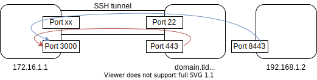

+++
chapter = false
title = "ssh"
weight = 5
tags=["networking","tools"]
+++

This page introduces diverse topics / functions related to SSH
which go beyond the basics. They are mostly unused by beginners
and casual SSH users but are very much 
appreciated once you know about them.

{}
SSH is sometimes referred to as "poor man's VPN".
{}

- There are two distinct parts to SSH: the client and the server.
- A user's client config can generally be found at `~/.ssh/` 
    - The `~/.ssh/config` file specifies parameters per host. This way, most
    ssh flags can be replaced.
- The server's config can be found at `/etc/ssh/sshd_config`.


## SSH


### Client Cheatsheet
Collection of rather common simple commands:

- `-p` flag to use a different port
- Most basic form to execute a remote command is using backticks:
`ssh user@domain.tld 'sudo apt install git'` <!-- TEST -->
- `ssh-copy-id user@host` to copy own public key to host

### Use the ssh config file
The ssh config file is located at `~/.ssh/config`.
Assume you originally wrote `ssh -p 2222 tony@192.168.1.2`. After writing
```
Host stark-machine
    User tony
    Hostname 192.168.1.2
    Port 2222
```
into the config file, you can now connect with `ssh stark-machine`.

{}
There are many directives for virtually any existing command line flag.
Some are outlined in other paragraphs where needed.
A comprehensive list see `man ssh_config`.
{}

### ssh proxy jump
A common scenario is that only one host in a LAN is exposed to the
outside, e.g., by port forwarding. Let's call it the *entry host*.
We might want to connect to a different host (call it *target host*)
inside that LAN that is not exposed to the outside.

What we can do first connect to the entry host, and from there to
the target host as the target host is in the same subnet as the
entry host:
{}
```bash
tony@stark:> ssh keeper@entryhost
keeper@entryhost:> ssh admin@targethost
admin@targethost:> echo "Hello World"
Hello World
```
{}

What we can do with ssh instead is make a proxy jump:

```
tony@stark:> ssh -J keeper@entryhost admin@targethost
```
This is equivalent to ssh'ing into entryhost and from there ssh'ing
into targethost.

{}
The same can be achieved by adding the `ProxyJump` directive for the
target host in `~/.ssh/config`.
{}

<!--Check: Not sure wheteher host1 or your own permissions count.-->

### Make remote port locally available
Using the `-L` flag, one can make a port locally available
that is visible from the remote host. The basic command
looks as follows:
``ssh -L localport:192.168.x.x:remoteport user@domain.tld``

In the above graphic, the arrows correspond to:
- Red: `ssh -L 3000:localhost:443 user@192.168.1.1`
- Blue: `ssh -L 3000:192.168.1.2:8443 user@192.168.1.1`

Assuming for example `192.168.1.1:443` was running a webserver,
we could on our local host (where we issued the command) open a
browser and go to `https://localhost:3000` and would find the
website hosted on `192.168.1.1:443`.

{}
The `localhost` in `ssh -L 3000:localhost:443 user@192.168.1.1` refers
to 192.168.1.1 (localhost from its perspective) whereas the `localhost`
in the URL refers to *your* localhost 172.16.1.1.
{}

The `-L` flag is used if the command is issued from the local machine,
i.e., when the target port should be made available locally.
There is also the `-R` flag which makes a port available on the
remote host.

TODO: more detailed -R command


### Automatic tmux session

Traditionally, if you experience connection loss during an ssh session,
logging back in brings you into a new shell with no access to the old one.
If you had a running program in the previous shell (e.g. compiling something)
you don't get access to it anymore. 
This is where tmux comes in as it allows
for tty sessions to exist over different ssh sessions. <!--improve last lines -->

Normally you would `ssh starkmachine` to connect and then 
`tmux new-session -s ssh-tmuxsession` to create a new session or after a connection
loss `tmux attach-session -t ssh-tmuxsession` to reattach.

Adding the following to `~/.ssh/config` allows you to automatically
attach to the session (or create it if it doesn't already exist)
every time you connect via ssh (i.e. on connecting with `ssh starkmachine`).
```
Host starkmachine
    User tony
    HostName 192.168.1.2
    RemoteCommand tmux new-session -A -s ssh-tmuxsession
    RequestTTY yes
```
An even more advanced variant to create new sessions on the fly:
```
Host starkmachine-*
    User tony
    HostName 192.168.0.12
    RemoteCommand tmux new-session -A -s ${%n}
    RequestTTY yes
```
[Resource](https://blog.jbowen.dev/tips/ssh-tmux/)

### Use SOCKS5 proxy
TODO

### Forward X11
TODO

this is not only ssh, sshd must be configured appropriately

## SSHD
config file location: `/etc/ssh/sshd_config`

- set `PubkeyAuthentification` to `yes` for auth via public key
- set `PasswordAuthentication` to `no` to only allow public key
- `systemctl restart sshd.service` for changes to take effect

*all of the above requires sudo*

[Reverse SSH tunnel](https://www.rustimation.eu/index.php/reverse-ssh-tunnel-schritt-fur-schritt/)
`ssh -p2000 -fNC -R 10011:localhost:22 pi@dyn.IP.adresse` for reverse

`ssh -p 10011 localhost` on gateway

Problems with cronjob at reboot.. here a solution:
[](https://github.com/axthosarouris/reverse-ssh-tunnel)


- `ssh-agent bash` to create a new agent
- `ssh-add ~/.ssh/id-rsa` to add key and enter password  
the above is valuable for cases like ansible, where otherwise
the password would need entering many times


